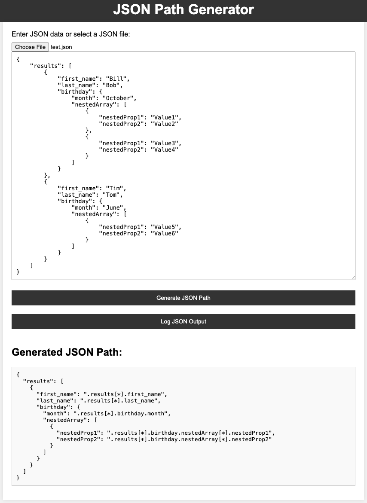

# JSON Output Generator

A simple web application that allows you to generate JSON paths from JSON data and log the results to a file on the server.



## Features

- Input JSON data manually or upload a JSON file.
- Generate JSON paths for key-value pairs in the JSON data.
- Log the generated JSON paths to a file on the server.
- User-friendly web interface.

## Prerequisites

- Node.js: Make sure you have Node.js installed on your system. You can download it from [nodejs.org](https://nodejs.org/).

## Getting Started

1. Clone this repository to your local machine:

   ```bash
   git clone https://github.com/yourusername/json-output-generator.git
   ```

2. Navigate to the project directory:

   ```bash
   cd json-output-generator
   ```

3. Install the required dependencies:

   ```bash
   npm install
   ```

4. Start the Node.js server:

   ```bash
   node app.js
   ```

5. Open your web browser and access the application at [http://localhost:3000](http://localhost:3000).

## Usage

1. On the web interface, you can enter JSON data manually or upload a JSON file.
2. Click the "Generate JSON Path" button to generate JSON paths for the input data.
3. To log the generated JSON paths to a file on the server, click the "Log JSON Output" button.

## Directory Structure

- `public/`: Static files (HTML, CSS, and JavaScript).
- `json_logs/`: Directory where log files are stored.
- `app.js`: Node.js server script.
- `README.md`: Documentation.

## License

This project is licensed under the MIT License - see the [LICENSE](LICENSE) file for details.

## Acknowledgments

- [Express.js](https://expressjs.com/) - Web application framework for Node.js.
- [Node.js](https://nodejs.org/) - JavaScript runtime for server-side development.
- [GitHub](https://github.com/) - Hosting for version control and collaboration.

## Authors

- Created by [Kai](https://github.com/kai-wss/)
- Prompted by [Kai](https://github.com/kai-wss/)
- Developed with ❤️ by [ChatGPT](https://github.com/chatgpt).
